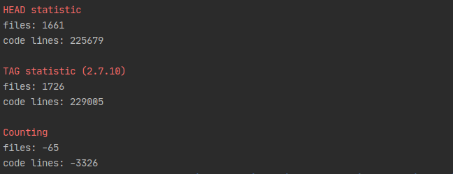
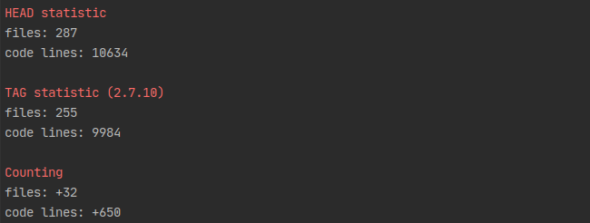

Assistant
===================


Assistant is a delightful files mod tool.

[](https://snapcraft.io/kg-assistant)

#### Info:

* search file by name (regex)
* exclude file by content (regex)
* sort files - standard by name, natural by name, last modification file
* rename files in folder with index
* size zeros in index
* uppercase extension in folder
* lowercase extension in folder
* statistic - show about files info (count lines, max/min size, max/min lines, etc)
* lines - counting lines by search regex

#### Usage:

```
Usage: kg-assistant COMMAND=ARG...

Assistant is a delightful files mod tool.

Options:
    --dir               Path to folder with files.
    --search            Pattern regex for search file in folder. If empty - all.
    --sort              Sort files: {natural} - by natural, {mod} - last modification
    --exclude           Pattern regex for exclude file by content
    --exclude-lines     Exclude lines content

  rename    
    --template          Template for name {text} - name file, {index} - set up index
    --zeros             Size count zeros in index. If empty - disable. If 0 - auto.

  extension
    --extension-up      Uppercase extension in folder
    --extension-lower   Lowercase extension in folder

  statistic
    --statistic   Lowercase extension in folder

  lines
    --lines             Find lines in dir and counting
    --lines-search      Pattern regex for search lines
    
  other
    --size              Get size files
    --version           Show the version and exit
    --help              Show help
```

#### Example statistic:

[Base script](../master/server/statistic.sh)

```
./statistic.sh -d=/home/user/my/path -s=".*\.java"
```



```
./statistic.sh --dir=/home/keygenqt/_CORE --search=".*\.kt"
```



GUI: AssistantQt
===================

[](https://snapcraft.io/kg-assistantQt)